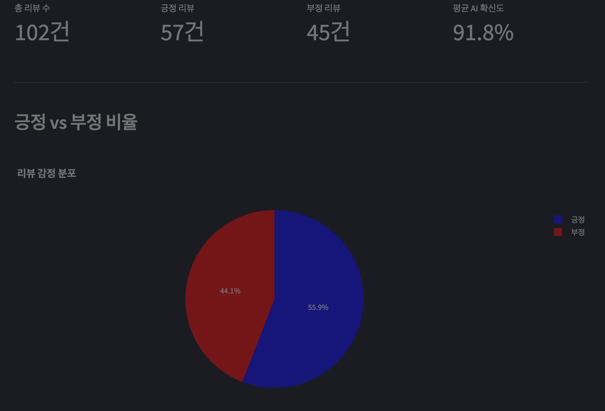
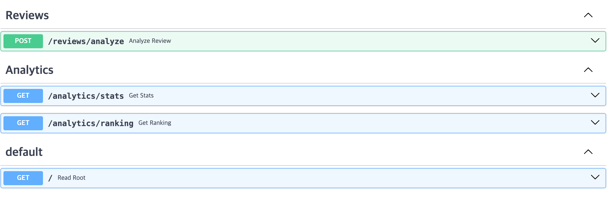

### README.md 

```markdown
# AI Shopping Review Analytics (AI 쇼핑 리뷰 분석 솔루션)

사용자의 쇼핑 리뷰 텍스트를 **AI(Deep Learning)** 모델로 분석하여 긍정/부정 여부를 판단하고, **실시간 대시보드**를 통해 비즈니스 인사이트를 제공하는 **Full-Cycle 백엔드 프로젝트**입니다.

   

## 실행 화면 (Screenshots)
| **Dashboard (Streamlit)** | **API Docs (Swagger UI)** |
|:-------------------------:|:-------------------------:|
|  |  |

## 프로젝트 소개 (Overview)
이 프로젝트는 대량의 리뷰 데이터를 효율적으로 처리하고 분석하기 위해 구축되었습니다. 단순한 CRUD API를 넘어, **AI 모델 서빙, 데이터 배치 처리, 시각화, 컨테이너 배포**까지 포함된 올인원 아키텍처를 지향합니다.

### 주요 기능 (Key Features)
1.  **AI 감정 분석 (Sentiment Analysis Pipeline)**
    - Hugging Face의 Pre-trained 한국어 모델(KoELECTRA)을 Fine-tuning 없이 서빙.
    - Singleton 패턴을 적용하여 모델 로딩 시간을 0초로 단축(Server Warm-up).
2.  **데이터 엔지니어링 (Batch Processing)**
    - 20만 건 이상의 대용량 리뷰 데이터를 안정적으로 적재하기 위한 Batch Script 구현.
    - Bulk Insert 최적화로 데이터 적재 속도 향상.
3.  **인터랙티브 대시보드 (Interactive Dashboard)**
    - Streamlit을 활용하여 별도의 프론트엔드 구축 없이 데이터 시각화 구현.
    - 실시간 긍정/부정 비율 파이 차트 및 키워드 랭킹 제공.
4.  **MSA 지향 아키텍처 & 배포 (Dockerized Architecture)**
    - `APIRouter`를 활용한 도메인별(Reviews, Analytics) 모듈 분리.
    - Docker Compose를 통해 Backend와 Frontend를 원클릭으로 실행 및 연결.

## 기술 스택 (Tech Stack)

| Category | Technology |
| :--- | :--- |
| **Language** | Python 3.11 |
| **Backend** | FastAPI, Pydantic, SQLAlchemy |
| **Database** | SQLite (Production 환경에서 PostgreSQL로 전환 용이) |
| **AI / ML** | PyTorch, Hugging Face Transformers |
| **DevOps** | Docker, Docker Compose |
| **Visualization** | Streamlit, Plotly |

## 프로젝트 구조 (File Structure)
```bash
ai-review-backend/
├── routers/               # API 라우터 (기능별 분리)
│   ├── reviews.py         # 리뷰 분석 및 저장 API
│   └── analytics.py       # 통계 및 랭킹 조회 API
├── data/                  # 데이터셋 저장소
├── models.py              # DB 테이블 스키마 정의 (ORM)
├── database.py            # DB 연결 설정
├── ai_model.py            # AI 모델 로딩 및 추론 로직
├── batch_process.py       # 대량 데이터 배치 처리 스크립트
├── dashboard.py           # Streamlit 대시보드 코드
├── main.py                # 앱 진입점 (설정 및 라우터 통합)
├── Dockerfile             # 도커 이미지 빌드 설정
├── docker-compose.yml     # 서비스 통합 실행 설정
└── requirements.txt       # 의존성 패키지 목록

```

## 실행 방법 (How to Run)

### 방법 1: Docker Compose 실행 (권장)

Docker가 설치되어 있다면 명령어 한 줄로 모든 서비스가 실행됩니다.

```bash
# 서비스 빌드 및 실행
docker-compose up --build

```

* **Backend API:** http://localhost:8000/docs
* **Dashboard:** http://localhost:8501

### 방법 2: 로컬 Python 환경 실행

Docker 없이 로컬에서 실행할 경우, 터미널 2개가 필요합니다.

**1. 환경 설정 및 라이브러리 설치**

```bash
python -m venv venv
source venv/bin/activate  # (Windows: venv\Scripts\activate)
pip install -r requirements.txt

```

**2. Backend 실행 (Terminal 1)**

```bash
uvicorn main:app --reload

```

**3. Dashboard 실행 (Terminal 2)**

```bash
streamlit run dashboard.py

```

## API 명세 (API Usage)

* **POST** `/reviews/analyze`: 리뷰 텍스트를 입력받아 감정 분석 후 저장.
* **GET** `/analytics/stats`: 전체 리뷰의 긍정/부정 통계 반환.
* **GET** `/analytics/ranking`: 확신도가 높은 Best/Worst 리뷰 Top 3 반환.

---

*Created by [KyunghunKIM]*

```


